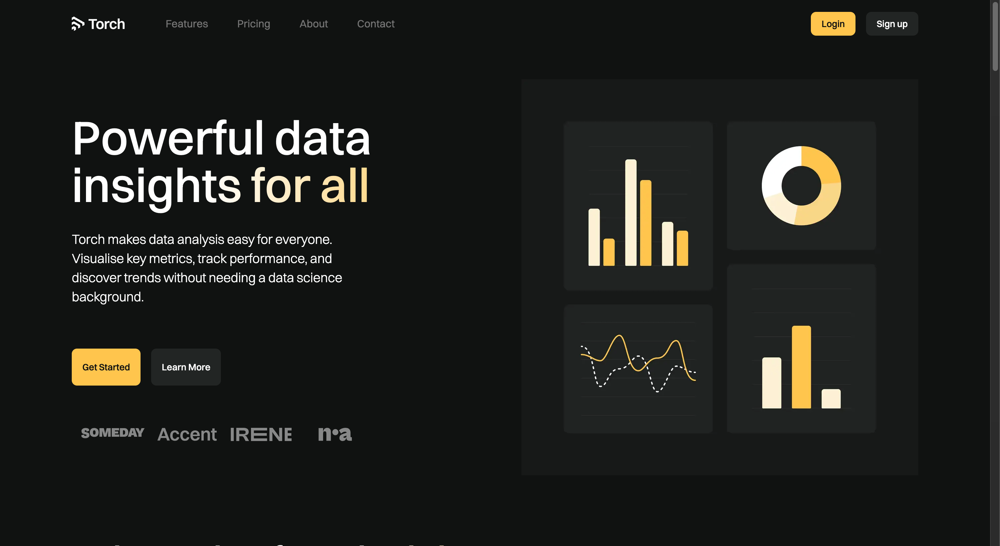

# Torch Landing Page

A modern **Next.js 15 + React 19** landing page for Torch Analytics Platform.

Built to showcase clean architecture, responsive design, SEO optimization, and modern UI components.  
**Inspired by the [Torch Webflow Template](https://torch-template.webflow.io/)**



## 🌐 Live Demo

**🔗 [View Live App](https://torch-clone.vercel.app/)**

---

## ✨ Features

- 🏠 **Multi-page Layout** with Home, Features, Pricing, About, and Contact pages
- 🌗 **Dark / Light Mode** with smooth theme transitions
- 📱 **Fully Responsive** design for all screen sizes
- 🎬 **Smooth Animations** powered by Framer Motion
- 🔍 **SEO Optimized** with centralized metadata management
- ♿ **Accessible Components** built with Radix UI
- 🎨 **Modern UI** with shadcn/ui component library

---

## 🧱 Tech Stack

- **Next.js 15** (App Router + React 19)
- **TypeScript** (Type safety)
- **Tailwind CSS v4** (Styling)
- **Framer Motion** (Animations)
- **Radix UI + shadcn/ui** (Components)
- **Lucide React** (Icons)
- **next-themes** (Theme management)

---

## 🗂️ Project Structure

```text
src/
├── app/              # Pages & layouts
│   ├── about/        # About page
│   ├── contact/      # Contact page
│   ├── features/     # Features page
│   ├── pricing/      # Pricing page
│   └── page.tsx      # Home page
├── components/       # UI components
│   ├── ui/          # shadcn/ui components
│   └── ...          # Feature components
└── lib/             # Utilities & constants
    ├── constants.ts # Site config & metadata
    └── utils.ts     # Helper functions
```

---

## 🚀 Getting Started

### 1. Clone repo

```bash
git clone https://github.com/mohamedyasser27/torch-clone
cd torch
```

### 2. Install Bun (if not installed)

```bash
# macOS / Linux
curl -fsSL https://bun.sh/install | bash

# Windows
powershell -c "irm bun.sh/install.ps1 | iex"
```

### 3. Install dependencies

```bash
bun install
```

### 4. Run locally

```bash
bun run dev

Visit http://localhost:3000
```

---

## 📝 Configuration

Edit `src/lib/constants.ts` to customize:

- Site name and description
- Social media links
- Image assets URLs
- Metadata defaults

---

## 🏗️ Build

```bash
bun run build
bun start
```

---

## 📄 License

This project is private and proprietary.

---

## 🙏 Credits

Design inspired by the [Torch Webflow Template](https://torch-template.webflow.io/) by Bryn Taylor.  
Built with ❤️ using Next.js and React.

